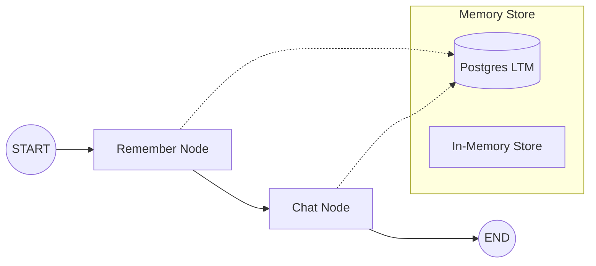

# Memory LangGraph: Long-Term Memory (LTM) Implementation

This project demonstrates how to implement **Long-Term Memory (LTM)** in AI agents using **LangGraph** and **LangChain**. It provides a robust framework for agents to remember user preferences, past interactions, and unique context across different sessions.

## 🚀 Features

- **Dual Storage Strategy**: 
  - `InMemoryStore`: For transient, session-based memory.
  - `PostgresStore`: For persistent, long-term memory across session restarts.
- **Semantic Memory Search**: Uses `GoogleGenerativeAIEmbeddings` to perform vector-based searches over stored memories, allowing the agent to retrieve relevant context.
- **Automated Memory Extraction**: A dedicated LangGraph node automatically extracts atomic facts from user messages and updates the memory store without manual intervention.
- **Personalized Responses**: The agent dynamically adjusts its tone and content based on the retrieved user profile.
- **Structured Output**: Uses Pydantic models for reliable memory extraction and decision-making.

## 🛠️ Technology Stack

- **Framework**: [LangGraph](https://github.com/langchain-ai/langgraph)
- **Orchestration**: [LangChain](https://github.com/langchain-ai/langchain)
- **AI Models**: Google Gemini (`gemini-1.5-flash`, `gemini-embedding-001`)
- **Database**: PostgreSQL (for persistent memory)
- **Language**: Python

## 📋 Prerequisites

- Python 3.10+
- PostgreSQL database (local or hosted)
- Google AI Studio API Key (for Gemini models)

## 🔧 Installation

1. **Clone the repository**:
   ```bash
   git clone https://github.com/Shayannoore/Memory_LangGraph.git
   cd Memory_LangGraph
   ```

2. **Create a virtual environment**:
   ```bash
   python -m venv .venv
   source .venv/bin/activate  # On Windows: .venv\Scripts\activate
   ```

3. **Install dependencies**:
   ```bash
   pip install -r requirements.txt
   ```

4. **Set up environment variables**:
   Create a `.env` file in the root directory and add your keys:
   ```env
   GOOGLE_API_KEY=your_google_api_key_here
   ```

## 📖 Usage

The project contains two main Jupyter notebooks:

1. **`LTM_Implementation.ipynb`**:
   - The full implementation of a LangGraph agent with a "remember" node and a "chat" node.
   - Demonstrates how to use `PostgresStore` for persistent memory.
   - Includes a sample workflow where the agent "remembers" the user's name and profession.

2. **`LongTermMemory.ipynb`**:
   - A detailed breakdown of the `InMemoryStore` and vector search capabilities.
   - Shows how to index and search memories using embeddings.

## 🏗️ Architecture

The agent is built using a stateful graph with the following nodes:

- **`remember`**: This node analyzes the user's latest message, compares it with existing memories, and extracts new atomic facts to store.
- **`chat`**: This node retrieves relevant memories for the current user and generates a personalized response.



## 📄 License

This project is licensed under the MIT License.
